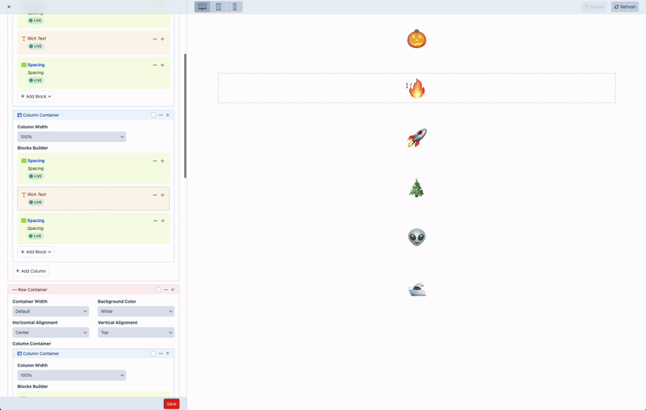

# PreviewMate v3

Find live preview matrix blocks with ease.

## Requirements
This plugin supports Craft CMS 5.0+

## Installation
To install the plugin, follow these instructions.

1. Open your terminal and go to your Craft project:

    cd /path/to/project

2. Then tell Composer to load the plugin:

    composer require nicholashamilton/craft-preview-mate

3. In the Control Panel, go to Settings → Plugins and click the “Install” button for PreviewMate.

## How to use



Preview blocks will be tracked in live preview when adding the `preview-block-id` attribute to the entry's HTML element.

```twig
{# option 1 (recommended) - only rendered in live preview #}
{{ craft.previewMate.previewBlock(entry) }}
```
or
```twig
{# option 2 - manually set the preview block id #}
preview-block-id="{{ entry.id }}"
```

That element will now be tracked in the live preview. Clicking on it in the preview will scroll you to the element in the editor. Hovering over it will highlight both the editor and preview elements.

## Usage example 

```twig
{# Matrix field #}


{# Render blocks #}

    <div {{ craft.previewMate.previewBlock(block) }}>
        {{ block.render() }}
    </div>

```

It's recommended to add styles for preview blocks using `preview-block-id`.
The hovering style will only be toggled during live preview.

```css
[preview-block-id] {
    position: relative;
}
[preview-block-id]::after {
    content: '';
    position: absolute;
    top: 0;
    left: 0;
    width: 100%;
    height: 100%;
    border: 1px dashed rgba(0, 0, 0, .333);
    pointer-events: none;
    opacity: 0;
    transition: opacity 300ms ease;
}
[preview-block-id].preview-block-hover::after {
    opacity: 1;
}
```